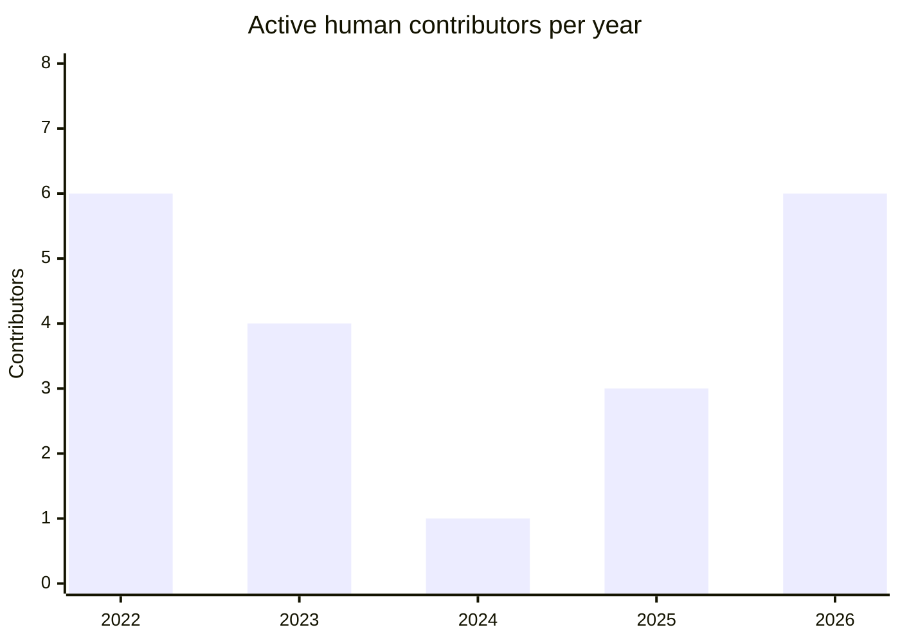

# FDC3 Sail - Semi-Annual Report 2026 H2

**Project Maintainers:**

| GitHub Username | Name         | Organization  | Email                       |
| --------------- | ------------ | ------------- | --------------------------- |
| @SeeWhatsOn     | Chris Watson | Elgin White   | cwatson1988@gmail.com       |
| @kriswest       | Kris West    | NatWest Group | kristopher.west@natwest.com |
| @robmoffat      | Rob Moffat   | FINOS         | rob.moffat@finos.org        |

**Repository:** https://github.com/finos/FDC3-Sail

**Links:**

- https://finos.github.io/FDC3-Sail/docs/ — documentation site
- https://github.com/finos/FDC3-Sail/pull/341 — the v3 release PR, open at time of writing
- https://insights.linuxfoundation.org/project/electron-fdc3 — LFX Insights (still listed under the pre-rename `electron-fdc3` slug; see Challenges)
- https://scorecard.dev/viewer/?uri=github.com/finos/FDC3-Sail — OpenSSF Scorecard

> _This is FDC3 Sail's first report under the semi-annual review process. Metrics are drawn from the GitHub API (25 August 2026) and from LFX Insights over the trailing-12-month window 2025-08-12 → 2026-08-12, which spans this H2 reporting period and the preceding half. Lifecycle stage: **Incubating**. License: Apache-2.0._

# Project Overview

FDC3 Sail is FINOS's open source implementation of the [FDC3](https://fdc3.finos.org) interoperability standard: a browser-first FDC3 2.2 **Desktop Agent** (`@finos/sail-desktop-agent`) that other packages compose into a broader interoperability platform (`@finos/sail-platform`), plus two example UI shells — `sail-finance`, a finance workspace dashboard, and `sail-one`, a domain-neutral tab-and-grid canvas.

Sail targets full FDC3 2.2 conformance today. v3 also lands the groundwork for FDC3 3.0 — version negotiation and the 3.0 error surface, including `fdc3.close` — ahead of the standard's own 3.0 release.

# Current Status

- **Real-world validation:** Sail's Desktop Agent was used in a live proof-of-concept with a buy-side firm between April and June 2026, and performed as expected — the project's first evidence of use outside the maintainer group. The firm cannot be named publicly; the maintainers can share details privately with the TOC liaison.
- **Electron target removed entirely** — the `sail-electron` package was deleted, eliminating a critical `nodeIntegration`/RCE exposure and refocusing the project as purely browser-first.
- **v3 is landing now.** The release PR ([#341](https://github.com/finos/FDC3-Sail/pull/341)) opened on 24 August 2026. It brings a fully browser-based finance UI with no server component — unlike earlier iterations — alongside the existing `sail-one` shell, and publishes the Desktop Agent as proper npm packages for the first time. Adopters can now choose their level of engagement: take just the Desktop Agent package, take `sail-platform` (which will carry additional composition capabilities), or clone the repo and customise either UI shell.
- **Package consolidation and API tightening** — in-repo example apps moved out to the FDC3 toolbox, the dead Zod validator replaced with schema validation from `@finos/fdc3-schema` wired on by default for inbound DACP/WCP messages, and the public export surface narrowed to a single curated entry point.
- **Security and OSS-health tooling landed:** CodeQL, OpenSSF Scorecard, OpenSSF Best Practices (CII project 12272, currently *passing*), Semgrep, dependency review, Node.js CVE scanning, a weekly OSPS Baseline assessment, and a Changesets release pipeline. Current **OpenSSF Scorecard score: 7.9**, with full marks on Token-Permissions, Dangerous-Workflow, Security-Policy, Binary-Artifacts, Fuzzing, Dependency-Update-Tool and Contributors.
- **Dense regression coverage** on the core agent — 60 Vitest files in `sail-desktop-agent` (85 across the monorepo) plus 17 Cucumber feature files / 154 scenarios, with a tag-coverage check that fails the build if FDC3 spec tags go untested.
- **New maintainer: Kris West** (NatWest Group, and lead maintainer of the FDC3 standard itself) joined the maintainer group. NatWest is expected to commit dedicated developer resource on top of this. <!-- [CONFIRM] is this now confirmed, and how much? -->
- Kris's dual role also positions Sail to become a **reference and conformance-testing implementation for the FDC3 standard itself** as 3.0 develops — a differentiator versus other desktop agents.

# Community & Contribution Metrics

_GitHub API figures as at 25 August 2026; LFX figures over the trailing 12 months._

## Contributor movement

The maintainer group **tripled this period**, from one to three, and the project added three new contributors while retaining every contributor from the prior quarter.

| Movement in the window | Count |
|---|---|
| New maintainers | **2** (Kris West, Rob Moffat) |
| New contributors | **3** |
| Retained from prior quarter | **3** (100% retention) |
| Distinct human contributors, project lifetime | **14** |

Bot and agent commits are excluded from these figures throughout.

### Five-year trajectory

LFX Insights reports on a single quarter, which understates what has happened here. Measured over the project's whole life, 2024 was the low point — one active contributor — and the project has since been rebuilt:

| Year | Active human contributors | Commits |
|---|---|---|
| 2022 | 6 | 329 |
| 2023 | 4 | 160 |
| 2024 | **1** | 132 |
| 2025 | 3 | 307 |
| 2026 (to 25 Aug) | **6** | **498** |

2026 has already matched the project's best-ever contributor count and passed its best-ever commit count with four months still to run. Figures are derived from the git history of `finos/FDC3-Sail` with bot and agent authors excluded and duplicate author identities merged.

| Metric | Value |
|---|---|
| Quarterly-active contributors (LFX) | **7**, with 100% quarter-over-quarter retention |
| Distinct commit authors in the window (git) | 7 |
| Pull requests opened in the window (LFX) | 38 (21 merged, 9 closed) |
| Pull requests opened lifetime | 158 (121 merged) |
| Open pull requests | **4** |
| Average merge lead time (LFX) | ~12 days |
| Issues opened in the window (LFX) | 111 (82 closed) |
| Open issues | **36** |
| Average issue-resolution time (LFX) | ~53 days |
| GitHub stars / forks | **48 / 39** |
| Active days in the window (LFX) | 93 of 365 |
| Contributions outside standard work hours (LFX) | 26% |
| OpenSSF Scorecard | **7.9** |
| npm downloads | none yet — first publication ships with v3 |

- **Releases:** v1.0.0 (Electron proof-of-concept) and v2.0.0 (web MVP) are published. v3 is targeted for release once [#341](https://github.com/finos/FDC3-Sail/pull/341) merges, at which point Sail packages reach npm for the first time.
- **Health:** LFX Insights rates the project **Healthy**; controls-assessment status is **Alpha**.
- **OSPS Baseline:** the assessment workflow runs weekly and last succeeded on 24 August 2026. <!-- [CONFIRM] state the maturity level reached, and name any Level 2 controls still failing with a date to close them. ML2 is the requirement for Incubating. -->
- **Meetings** are held via LF Zoom; agendas and minutes are tracked as GitHub issues labelled `meeting`. <!-- [CONFIRM] cadence and typical attendance -->

# Challenges & Blockers

The maintainers would rather state these plainly than have them surfaced during the review.

1. **Contribution concentration — the primary risk.** LFX flags 1 contributor and 1 organisation each accounting for 51%+ of contributions. Kris West's addition helps, but the goal is to diversify beyond the current set of backing organisations (NatWest, FINOS, Elgin White), not simply to add a second one.
2. **Dependency vulnerabilities.** Scorecard scores the Vulnerabilities check 0/10 against 45 known advisories; `npm audit --omit=dev` reports 25 in production dependencies. Remediation is in progress and the majority clear with a straightforward dependency bump. <!-- [CONFIRM] run `npm audit fix`, then restate the residual count here -->
3. **Vulnerability reporting is not yet private.** `SECURITY.md` currently directs reporters to open a public issue, and GitHub private vulnerability reporting is not enabled. This is being corrected as a priority.
4. **No external FDC3 app integrations yet.** The proof-of-concept validated the agent itself, but Sail has not yet been paired with a third-party FDC3 app in a publicly visible way.
5. **Not yet published to npm** — resolved by the v3 release, but until then there is no downloads signal to point to.
6. **Issue-resolution lag** — ~53 days on average despite reasonable PR velocity, indicating triage and maintenance capacity is the constraint rather than code throughput. Three pull requests ([#238](https://github.com/finos/FDC3-Sail/pull/238), [#312](https://github.com/finos/FDC3-Sail/pull/312), [#333](https://github.com/finos/FDC3-Sail/pull/333)) have been open since March, June and July respectively. <!-- [CONFIRM] does the v3 rewrite supersede these? Say so, or say what is blocking them. -->
7. **Documentation drift.** The fast-moving v3 refactor left docs describing packages and scripts that no longer exist. The project has committed to treating docs as the blueprint going forward and reconciling code to them.
8. **Tracking a moving standard.** Sail implements FDC3 3.0 behaviour ahead of the standard's own release, so parts of the 3.0 surface (for example `CloseError`) are hand-maintained until upstream `@finos/fdc3` ships them.
9. **LFX project slug is stale.** Sail is still listed on LFX Insights as `electron-fdc3` — the pre-rename slug, for a project whose headline this cycle is that Electron has been removed. A rename would help discoverability of the project's own health data.

# Roadmap & Goals for Next 6 Months

- **Ship v3** — merge [#341](https://github.com/finos/FDC3-Sail/pull/341) and publish npm packages for the first time.
- **Onboard one actively contributing organisation from outside the current backing set.** By "actively contributing" the maintainers mean sustained enough participation in issues, PRs and reviews to justify electing a maintainer from that organisation.
- **Produce one citable external integration story** — pair Sail with a third-party FDC3 app and publish the result.
- **Close the security gaps** — private vulnerability reporting enabled, dependency advisories cleared, and OSPS Baseline Maturity Level 2 evidenced in the next report.
- **Track FDC3 3.0 to completion** and establish Sail as a reference and conformance-testing implementation for the standard.
- **Build v3 momentum publicly** — webinars around the launch, building toward **OSFF New York (November 2026)**, where Sail plans to present the new release. <!-- [CONFIRM] status of the conference talk submission -->
- **Reduce the issue backlog and resolution time.**
- **Rebuild the documentation site** as an accurate blueprint synchronised with the v3 codebase.

# TOC Support Needed

How can the TOC help FDC3 Sail achieve its upcoming goals?

- **Growing the contributor and user base — the primary ask.** Specifically: introductions to member firms evaluating FDC3 desktop agents, and help converting current inbound interest into the one new contributing organisation named above.
- **Visibility** — amplifying the v3 launch and the NatWest maintainer addition, particularly around OSFF New York.
- **Cross-project collaboration.** FDC3, FDC3 Sail and Backplane all present in the same session. Given Kris West's dual role as Sail maintainer and lead maintainer of the FDC3 standard, the maintainers would like to discuss a joint story: Sail as the reference and conformance-testing implementation for FDC3 3.0, with Backplane covering bridging.
- **Lifecycle guidance.** Sail expects to remain **Incubating** this cycle. The maintainers' view is that the path to Graduated runs through the v3 npm release, named production adopters and OSPS Baseline Level 3 — and would welcome the TOC's view on what evidence a future graduation review would need.

# Additional Information

- FDC3 Sail is an npm-workspaces monorepo: `sail-desktop-agent` (the FDC3 Desktop Agent core), `sail-platform` (composition layer), `sail-theme` (shared design tokens), `sail-finance` and `sail-one` (example UI shells), `sail-conformance-harness`, and a Docusaurus documentation site.
- Version history: **v1** (Electron proof-of-concept) → **v2** (web-based MVP, not aiming for production, introduced the `sail-one` shell) → **v3** (server-free browser-based finance UI, npm-packaged for a-la-carte adoption).
- The project requires PR-based contribution with CI gates covering format, build, lint, typecheck, unit tests, Cucumber conformance scenarios and a docs build.
