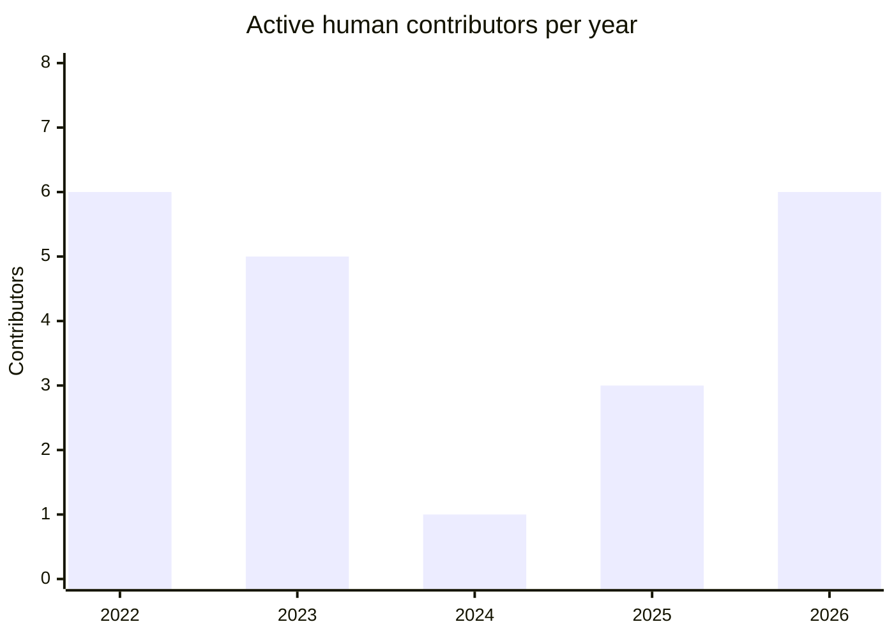
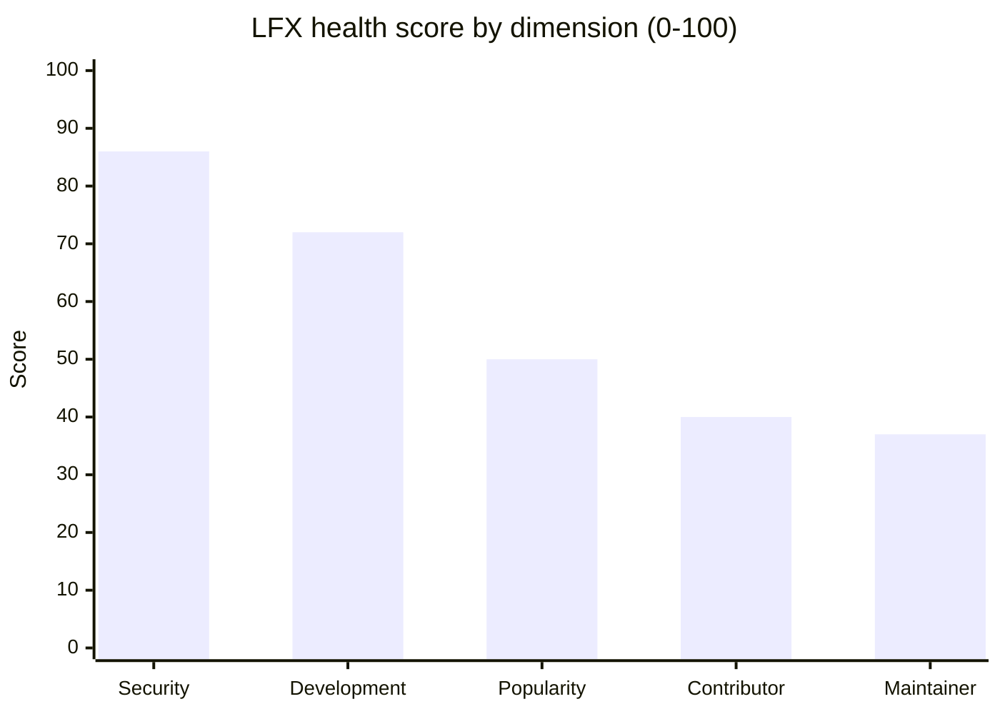
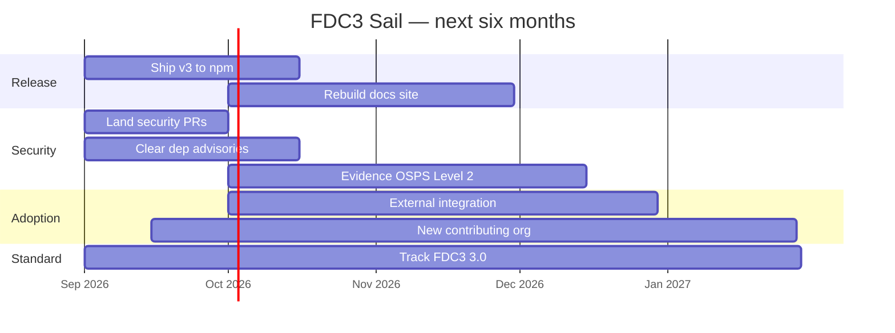

# FDC3 Sail - Semi-Annual Report 2026 H2

**Project Maintainers:**

| GitHub Username | Name         | Organization  | Email                       |
| --------------- | ------------ | ------------- | --------------------------- |
| @SeeWhatsOn     | Chris Watson | Elgin White   | cwatson1988@gmail.com       |
| @kriswest       | Kris West    | NatWest Group | kristopher.west@natwest.com |
| @robmoffat      | Rob Moffat   | FINOS         | rob.moffat@finos.org        |

**Repository:** https://github.com/finos/FDC3-Sail

**Links:**

- [User guide](https://github.com/finos/FDC3-Sail/blob/main/docs/GUIDE.md) — the published docs site is offline; see Challenges
- [PR #341](https://github.com/finos/FDC3-Sail/pull/341) — the v3 release, open at time of writing
- [LFX Insights](https://insights.linuxfoundation.org/project/electron-fdc3) — still under the pre-rename `electron-fdc3` slug
- [OpenSSF Scorecard](https://scorecard.dev/viewer/?uri=github.com/finos/FDC3-Sail) — 7.9

> _First report under the semi-annual process. Lifecycle: **Incubating**. Licence: Apache-2.0. GitHub API figures as at 26 August 2026; LFX figures are live reads of the trailing 12 months, taken 26 August 2026._

# Project Overview

FDC3 Sail is FINOS's open source implementation of the [FDC3](https://fdc3.finos.org) standard: a browser-first FDC3 2.2 **Desktop Agent** (`@finos/sail-desktop-agent`), a composition layer (`@finos/sail-platform`), and two example UI shells — `sail-finance` and `sail-one`.

**The short version of this cycle:** the project went from one contributor to three maintainers and six contributors, deleted its Electron attack surface, measured its security posture for the first time, and is shipping v3 to npm. It now needs reviewers and real-world adopters.

## How Sail got here

| Period   | What happened                                                                     |
| -------- | --------------------------------------------------------------------------------- |
| Feb 2022 | Started as `electron-fdc3`, an Electron FDC3 container, by Nick Kolba             |
| 2023     | Handed over to Rob Moffat                                                         |
| **2024** | **Rob was the only contributor — 130 commits, one person, no bus factor**         |
| 2025     | Rebuilt for the web; v2 ships. Chris Watson's first commit lands in May           |
| **2026** | **Kris West joins. Three maintainers, six contributors — matching the 2022 peak** |

The work of this period was to make Sail sturdy rather than to add features. v3 finishes what the rename started: browser-first, no server component, published to npm. Sail targets full FDC3 2.2 conformance today and lands the groundwork for FDC3 3.0 — version negotiation and the 3.0 error surface, including `fdc3.close` — ahead of the standard's own release.

The goal is **production-ready software while remaining Incubating this cycle.**

# Current Status

**Adoption and validation**

- **First use outside the maintainer group.** Sail's Desktop Agent ran in a live proof-of-concept with a buy-side firm, April–June 2026, and performed as expected. The firm cannot be named publicly; details can be shared privately with the TOC liaison.
- **v3 makes adoption a-la-carte.** The release PR ([#341](https://github.com/finos/FDC3-Sail/pull/341)) opened 24 August 2026. Adopters can take just the Desktop Agent package, take `sail-platform`, or clone and customise a UI shell. **npm publication is the first ever for the project.**
- **Kris West's dual role** as Sail maintainer and lead maintainer of the FDC3 standard positions Sail as a **reference and conformance-testing implementation** for FDC3 3.0 — a differentiator versus other desktop agents.

**Engineering**

- **Electron removed entirely** — the `sail-electron` package was deleted, eliminating a critical `nodeIntegration`/RCE exposure.
- **API tightened** — example apps moved to the FDC3 toolbox, the dead Zod validator replaced with `@finos/fdc3-schema` validation on by default for inbound DACP/WCP messages, exports narrowed to one curated entry point.
- **Security tooling landed** — CodeQL, Scorecard, OpenSSF Best Practices (CII 12272, _passing_), Semgrep, dependency review, Node.js CVE scanning, weekly OSPS Baseline assessment, Changesets release pipeline.
- **Dense regression coverage** — 85 Vitest files across the monorepo (60 in the agent), 17 Cucumber features / 154 scenarios, with a tag-coverage check that fails the build if FDC3 spec tags go untested.

# Community & Contribution Metrics

## Growth

The maintainer group **tripled**, from one to three. New this period: **2 maintainers** (Kris West, Rob Moffat) and **3 new contributors**, with **100% retention** of the prior quarter's contributors. 2026 has already matched the project's best-ever contributor count with four months still to run. Bot and agent commits are excluded throughout; commit figures are `main` only, excluding merges, with duplicate author identities merged.

| Year             | Contributors | Commits to `main` |
| ---------------- | ------------ | ----------------- |
| 2022             | 6            | 244               |
| 2023             | 5            | 133               |
| 2024             | **1**        | 130               |
| 2025             | 3            | 78                |
| 2026 (to 26 Aug) | **6**        | 18                |

The 2026 commit column is not a slowdown: the v3 rewrite arrives as a single PR carrying **819 changed files and ~513,000 added lines in two commits**, none of it on `main` yet.

LFX measures participation more broadly than commits — issues and reviews count — and shows the same shape:

| LFX measure          | Previous 365d | Last 365d |
| -------------------- | ------------- | --------- |
| Active contributors  | 21            | **35**    |
| Active organisations | 10            | **20**    |
| Stars gained         | 8             | 10        |

## Where the project is strong, and where it is not

LFX scores Sail **77/100, "healthy"**. The dimension breakdown is the single clearest picture of this reporting period:

**Security is the strongest dimension and maintainer capacity the weakest.** The hardening work has landed; the bandwidth to keep landing it has not. That is the ask in this report.

## Throughput

| Metric                                 | Value                                 |
| -------------------------------------- | ------------------------------------- |
| Issues opened / closed, last 12 months | 112 / **92**                          |
| PRs opened / merged, last 12 months    | 44 / **25**                           |
| Open issues / open PRs                 | 36 / **9**                            |
| Median first response — PR / issue     | **~24h** / **~21h**                   |
| Median time to merge a PR              | ~7 days                               |
| Median time to close an issue          | ~30 days                              |
| Contributors, project lifetime         | 14 (git) · 28 (LFX, incl. non-code)   |
| Stars / forks                          | **48 / 39**                           |
| OpenSSF Scorecard                      | **7.9**                               |
| npm downloads                          | none yet — first publication ships v3 |

**Read this carefully, because it is not a responsiveness problem.** Sail answers a pull request in about a day and closes 82% of the issues raised against it. What three people cannot do is _review_ — and that is where work stalls. Nine PRs are open as this is written, two of them security fixes that cannot merge without a reviewer from outside the maintainer group.

**Other signals:** 100% quarter-over-quarter contributor retention · 93 active days of 365 · 26% of contributions outside standard work hours · meetings every two weeks on LF Zoom, attendance typically three or four, tracked as issues labelled `meeting`.

## OSPS Baseline position

The weekly assessment workflow had been reporting success while producing no assessment — it passed a repository secret that does not exist, so despite a green tick **no maturity level had ever been evidenced**. The fix is [#343](https://github.com/finos/FDC3-Sail/pull/343). Running the scanner (catalog `osps-baseline-2026-02`) against `main` on 25 August 2026 gives the real position:

| Maturity level                    | Passed | Needs review | Failed |
| --------------------------------- | ------ | ------------ | ------ |
| Level 1                           | 12     | 2            | **3**  |
| Level 2 — required for Incubating | 16     | 7            | **6**  |

| Level 2 failure | Gap                                        | Closes via                                                                |
| --------------- | ------------------------------------------ | ------------------------------------------------------------------------- |
| `OSPS-DO-01`    | User guide not declared                    | [#343](https://github.com/finos/FDC3-Sail/pull/343) — awaiting review     |
| `OSPS-QA-04`    | Repository list not declared               | [#343](https://github.com/finos/FDC3-Sail/pull/343) — awaiting review     |
| `OSPS-QA-05`    | `.DS_Store` committed at repo root         | [#343](https://github.com/finos/FDC3-Sail/pull/343) — awaiting review     |
| `OSPS-VM-03`    | No private reporting contact; PVR disabled | [#342](https://github.com/finos/FDC3-Sail/pull/342) + **needs org admin** |
| `OSPS-QA-03`    | Six status checks run, none mandatory      | **Needs org admin**, September 2026                                       |
| `OSPS-DO-06`    | No dependency management policy            | Policy to be written, Q4 2026                                             |

Four of the six stem from a missing `security-insights.yml`; #343 adds one and closes three. **Level 1 clears entirely once that PR merges.**

**A blind spot worth flagging to the TOC.** Two Level 1 controls (`OSPS-AC-03` branch protection, `OSPS-BR-07` secret scanning) sit at _needs review_ because no assessor can see the settings. GitHub's branch-protection API requires repo `admin`; the maintainers hold `maintain` and get a `404`, and LFX Insights hits the same wall and records `branchProtectionEnabled: null`. The public API confirms only `protected: true`, with no detail. **Two independent tools therefore report Sail's branch protection as unverifiable when it is in fact configured.** Migrating `main` from classic branch protection to a **repository ruleset** — publicly readable on a public repo — would fix both at once. Sail has no rulesets today, and this also needs an org admin.

# Challenges & Blockers

The maintainers would rather state these plainly than have them surfaced during the review.

1. **Review capacity is the bottleneck — the primary risk.** Three maintainers, nine open PRs, and two security PRs ([#342](https://github.com/finos/FDC3-Sail/pull/342), [#343](https://github.com/finos/FDC3-Sail/pull/343)) that cannot land without an outside reviewer.
2. **Contribution concentration.** LFX flags 1 contributor at **56%** of contributions and 1 organisation at **58%**; bus factor **3**. The goal is to diversify beyond NatWest, FINOS and Elgin White — not simply to add a fourth.
3. **Dependency vulnerabilities.** `npm audit` on `main`, 25 August 2026: **11 advisories in production dependencies** (3 high, 7 moderate, 1 low; no critical), down from 25 earlier in August. **Every one has a non-breaking fix and none needs a major bump** — eight clear with `npm audit fix`, three with a bump to `@finos/fdc3@2.2.3`. Targeted to close with v3. Scorecard still reads 0/10 on Vulnerabilities, but that scan is dated 17 August and predates this work.
4. **Vulnerability reporting is not yet private.** `SECURITY.md` directs reporters to open a public issue. A rewrite aligning with the [FINOS disclosure policy](https://community.finos.org/docs/governance/software-projects/cve-responsible-disclosure) is open as [#342](https://github.com/finos/FDC3-Sail/pull/342). **Enabling PVR itself requires a FINOS org admin.**
5. **No external FDC3 app integrations yet.** The proof-of-concept validated the agent; Sail has not been paired with a third-party FDC3 app publicly.
6. **Not yet on npm** — resolved by v3, but until then there is no downloads signal.
7. **Two long-lived PRs.** [#312](https://github.com/finos/FDC3-Sail/pull/312) (WSCP, open since June) will be carried forward onto v3; [#238](https://github.com/finos/FDC3-Sail/pull/238) (config screens, open since March) is superseded by the v3 rewrite and will be closed with an explanation to its author.
8. **Documentation drift.** The v3 refactor left docs describing packages that no longer exist, and the docs site is offline — GitHub Pages is not enabled, so `finos.github.io/FDC3-Sail/` returns 404. Docs will be treated as the blueprint going forward.
9. **Tracking a moving standard.** Sail implements FDC3 3.0 behaviour ahead of its release, so parts of the 3.0 surface (e.g. `CloseError`) are hand-maintained until upstream `@finos/fdc3` ships them.
10. **Stale LFX slug and tags.** The display name is correct ("FDC3 Sail") but the URL slug is still `electron-fdc3` and the tags are `electron`, `fdc3` — for a project whose headline this cycle is that Electron is gone.

# Roadmap & Goals for Next 6 Months

- **Ship v3** — merge [#341](https://github.com/finos/FDC3-Sail/pull/341) and publish npm packages for the first time.
- **Get Sail running in real environments.** A citable external integration story — Sail paired with a third-party FDC3 app, published — plus conversion of current inbound interest into named evaluations.
- **Onboard one actively contributing organisation from outside the current backing set** — meaning sustained enough participation in issues, PRs and reviews to justify electing a maintainer from it.
- **Close the security gaps** — PVR enabled, dependency advisories cleared, **OSPS Baseline Level 2 evidenced in the next report**.
- **Establish Sail as the reference and conformance-testing implementation** for FDC3 3.0.
- **Build v3 momentum publicly** — webinars around the launch.
- **Rebuild the documentation site** as an accurate blueprint synchronised with v3.

# TOC Support Needed

**Three things can be actioned directly, and the maintainers cannot do them alone:**

1. **Send us reviewers — the single most useful thing anyone can give us.** Three maintainers cannot review their own security fixes. Maintainer-level reviewers from other FINOS projects, or FINOS staff time, would move more than any other intervention. [#342](https://github.com/finos/FDC3-Sail/pull/342) and [#343](https://github.com/finos/FDC3-Sail/pull/343) are open and waiting as this is written.
2. **Enable GitHub private vulnerability reporting** on `finos/FDC3-Sail`. Requires `admin`; the maintainers hold `maintain`. This is the remaining half of `OSPS-VM-03`.
3. **Make the six existing status checks required on `main`.** They run on every PR but none are mandatory, failing `OSPS-QA-03`. Doing it as a **repository ruleset** rather than classic branch protection would also make the configuration machine-readable to OSPS, LFX and Scorecard, closing `OSPS-AC-03` at the same time.

**And the longer-running asks:**

4. **Help us get Sail into real environments.** Introductions to member firms evaluating FDC3 desktop agents, and help converting inbound interest into the new contributing organisation above. This is the primary growth ask.
5. **Visibility** — amplify the v3 launch and the NatWest maintainer addition, particularly around OSFF New York.
6. **Cross-project collaboration.** FDC3, FDC3 Sail and Backplane present in the same session. Given Kris West's dual role, the maintainers would like to discuss a joint story: Sail as the reference and conformance-testing implementation for FDC3 3.0, with Backplane covering bridging.
7. **Lifecycle guidance.** To be explicit, because "production grade" is easy to misread as a lifecycle claim: the maintainers are aiming for **production-ready software while remaining Incubating**, with v3 as the marker. Their view is that the path to Graduated then runs through the npm release, named production adopters and OSPS Baseline Level 3 — and they would welcome the TOC's view on what evidence a graduation review would need.

# Additional Information

- **Monorepo (npm workspaces):** `sail-desktop-agent` (the Desktop Agent core), `sail-platform` (composition), `sail-theme` (design tokens), `sail-finance` and `sail-one` (example shells), `sail-conformance-harness`, and a Docusaurus docs site (currently unpublished).
- **Version history:** **v1** Electron proof-of-concept → **v2** web MVP, not aiming for production → **v3** server-free browser UI, npm-packaged for a-la-carte adoption.
- **Contribution model:** PR-based, with CI gates covering format, build, lint, typecheck, unit tests, Cucumber conformance scenarios and a docs build.
