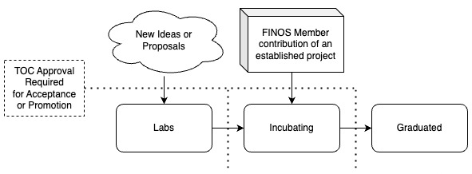

# Project Lifecycle

FINOS projects are categorized by maturity and activity according to the FINOS Project Lifecycle, aliging to the [CNCF maturity](https://github.com/cncf/toc/blob/main/process/README.md) and [repostatus.org status](https://www.repostatus.org/) models. The lifecycle is designed to help users easily determine which projects are appropriate for their use and to give FINOS maintainers a roadmap for progressing their projects. 

The lifecycle includes two axes: maturity and status.

## Maturity

A project's maturity is a reflection of it's governance and community involvement, not a statement on the project's quality or usefulness. 

The maturity stages are:

- **[Labs](stages/Labs.md)** - experimental or innovative projects that are early in their life
- **[Incubation](stages/Incubating.md)** - for projects that have a degree of completeness and are ready for wider use and contribution
- **[Graduated](stages/Graduated.md)** - for mature, active projects with healthy and diverse contributor communities
- **[Archived](stages/Archived.md)** - for projects that are no longer actively maintained

Prior to acceptance or promotion, a project must be reviewed by the TOC to ensure it meets the criteria for the desired maturity level. For information about the promotion criteria, please view the associated maturity level document.

## Project Status

A project's status is a signal from the TOC about the level of support or future functional releases or security patches that can be expected.
The status of the project is independent of maturity, and can change over time to provide further information to consumers and potential contributors alike.

The statuses a project may be assigned follow the guidelines provided by [repostatus.org](https://www.repostatus.org/):

  *  **Concept** – Minimal or no implementation has been done yet, or the repository is only intended to be a limited example, demo, or proof-of-concept.
  *  **WIP** – Initial development is in progress, but there has not yet been a stable, usable release suitable for the public.
  *  **Suspended** – Initial development has started, but there has not yet been a stable, usable release; work has been stopped for the time being but the author(s) intend on resuming work.
  *  **Abandoned** – Initial development has started, but there has not yet been a stable, usable release; the project has been abandoned and the author(s) do not intend on continuing development.
  *  **Active** – The project has reached a stable, usable state and is being actively developed.
  *  **Inactive** – The project has reached a stable, usable state but is no longer being actively developed; support/maintenance will be provided as time allows.
  *  **Unsupported** – The project has reached a stable, usable state but the author(s) have ceased all work on it. A new maintainer may be desired.
  *  **Moved** - The project has been moved to a new location, and the version at that location should be considered authoritative. This status should be accompanied by a new URL.

### Displaying Project Status

Project or repo status information should be displayed prominently at the top of each repo in the project, and/or in a [Security Insights](https://github.com/ossf/security-insights-spec) file at the root or `.github/` directory.

In the event that a project has multiple repositories, each repo must be marked with a status.

A project may choose to designate a single project repository as a lower status level than the primary project status, but not higher. For example, a project may have an "Active" status, but designate a specific repository as "Inactive" if it is no longer being actively developed.

### How Project Status and Maturity interact

The [status lifecycle](https://www.repostatus.org/lifecycle) focuses on the split between stable and unstable states of delivery:

The following is a non-exclusive overview of possible project statuses per Maturity level:

| Maturity | Possible Status | Notes |
|--|--|--|
| Labs | Concept, WIP, Abandoned, Suspended | If a Labs project remains at Suspended for one year, it will be changed to Abandond and Archived by the TOC |
| Incubating | WIP, Suspended, Active, Inactive | All Incubated projects will remain in WIP or Suspended status until a stable, usable release is made to signal transition into Active status. * |
| Graduated | Active, Inactive | * |
| Archived | Unsupported, Moved | Inactive projects that have been moved or are no longer supported |

> [!NOTE]
> Review the project maturity stages for information about when and how projects are promoted or archived.
